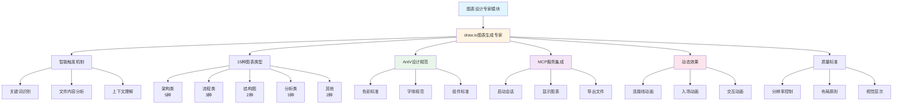

# 图表设计专家模块 - AI 上下文文档

> **导航**: [根目录](../../CLAUDE.md) > [提示词模板库模块](../CLAUDE.md) > **图表设计专家模块**

---

**注意**: 本模块路径为 `06-提示词模板库/05-图表设计/`

---

## 📋 模块概述

**模块名称**: 图表设计专家模块  
**模块类型**: 专业提示词配置库  
**模块定位**: 专注于智能图表生成和可视化设计的专业专家库，基于MCP服务实现draw.io图表的自动化生成

### 核心功能
- 🎨 提供专业的图表设计专家配置
- 📊 支持15种专业图表类型自动识别和生成
- 🎯 严格遵循阿里巴巴AntV设计规范
- ⚡ 集成draw.io MCP服务，实现自动化图表生成
- ✨ 支持动态效果（连接线动画、入场动画、交互动画）
- 📐 专业级质量标准控制（300dpi/600dpi/1200dpi）

---

## 📁 模块结构

### 目录树
```
05-图表设计/
├── CLAUDE.md                    # 本文件，模块说明文档
├── README.md                     # 专家导航文档
└── draw.io图表生成专家.md       # draw.io图表生成专家模板
```

### 项目结构图（Mermaid）



### 子模块说明

| 文件 | 路径 | 功能 | 复杂度 |
|------|------|------|--------|
| draw.io图表生成专家 | `draw.io图表生成专家.md` | 智能图表自动生成，支持15种图表类型 | ⭐⭐⭐⭐ |

---

## 🔗 模块依赖

### 内部依赖
- **无**: 图表设计专家配置相对独立，可单独使用

### 外部依赖
- **Trae IDE** 或类似AI平台（用于创建智能体）
- **draw.io MCP服务**（必需，用于图表生成）
- **Node.js环境**（用于运行MCP服务）

---

## 📖 关键文件说明

### 入口文件

#### 1. README.md
- **位置**: `05-图表设计/README.md`
- **作用**: 专家导航文档，帮助用户快速了解和使用图表设计专家
- **关键内容**:
  - 专家快速导航
  - 使用场景说明
  - 典型工作流程
  - 使用技巧与最佳实践

#### 2. draw.io图表生成专家.md
- **位置**: `05-图表设计/draw.io图表生成专家.md`
- **功能**: 专业的智能图表设计专家配置
- **适用场景**: 
  - 系统架构图设计
  - 业务流程图设计
  - 技术架构图设计
  - 时序图设计
  - 其他专业图表设计
- **复杂度**: ⭐⭐⭐⭐
- **关键特性**:
  - **智能触发机制**: 支持关键词识别、文件内容分析、上下文理解
  - **15种图表类型**: 涵盖架构、流程、结构、分析等专业图表
  - **阿里巴巴AntV规范**: 严格遵循企业级设计标准
  - **MCP服务集成**: 自动调用draw.io MCP服务
  - **动态效果支持**: 连接线动画、入场动画、交互动画
  - **质量标准控制**: 300dpi/600dpi/1200dpi分辨率、标准色彩字体、F型布局

---

## 🎯 使用场景

### 典型工作流程

#### 系统架构图设计流程
```
业务需求 → draw.io图表生成专家
    ↓
智能识别图表类型（系统架构图）
    ↓
启动draw.io MCP服务
    ↓
生成专业架构图（遵循AntV规范）
    ↓
应用动态效果
    ↓
导出.drawio文件
```

#### 业务流程图设计流程
```
流程需求 → draw.io图表生成专家
    ↓
智能识别图表类型（业务流程图）
    ↓
解析业务流程节点
    ↓
生成专业流程图
    ↓
添加连接线动画
    ↓
导出标准文件
```

#### 技术文档图表生成流程
```
技术文档 → draw.io图表生成专家
    ↓
文件内容分析
    ↓
识别多个图表需求
    ↓
批量生成专业图表
    ↓
统一设计风格
    ↓
导出图表库
```

---

## 🔧 接口与依赖

### 输入接口
- **用户需求**: 通过AI对话框输入图表需求（自然语言描述）
- **文件上传**: 上传相关文档，系统自动分析图表需求
- **上下文信息**: 结合对话历史理解用户意图

### 输出接口
- **.drawio文件**: 标准draw.io格式图表文件
- **实时预览**: 在浏览器中实时预览生成的图表
- **图表XML**: 可直接编辑的图表XML代码

### MCP服务接口
- **start_session**: 启动draw.io会话
- **display_diagram**: 显示生成的图表
- **export_diagram**: 导出图表文件

---

## 📊 模块统计

### 文件统计
- **总专家数**: 1个
- **图表类型支持**: 15种
- **设计规范**: 阿里巴巴AntV标准
- **动态效果**: 3种（连接线动画、入场动画、交互动画）

### 内容覆盖
- ✅ **架构类图表**: 系统架构、应用架构、技术结构、部署架构、安全架构
- ✅ **流程类图表**: 业务流程图、功能流程图、时序图
- ✅ **结构类图表**: 功能结构图、逻辑图
- ✅ **分析类图表**: 对比图、概念图、甘特图
- ✅ **设计规范**: 严格遵循阿里巴巴AntV设计语言
- ✅ **质量标准**: 专业级分辨率、色彩、字体、布局控制

---

## 🚀 快速开始

### 选择专家指南

#### 按图表类型选择
- **架构类图表** → draw.io图表生成专家（系统架构、应用架构、技术结构、部署架构、安全架构）
- **流程类图表** → draw.io图表生成专家（业务流程图、功能流程图、时序图）
- **结构类图表** → draw.io图表生成专家（功能结构图、逻辑图）
- **分析类图表** → draw.io图表生成专家（对比图、概念图、甘特图）

#### 按使用场景选择
- **技术文档**: 系统架构图、技术结构图、部署架构图
- **业务流程**: 业务流程图、功能流程图、时序图
- **项目规划**: 甘特图、功能结构图
- **方案对比**: 对比图、概念图

### 使用流程

#### 步骤1: 准备需求
- 明确图表类型和用途
- 准备相关文档（可选）
- 确定设计风格要求

#### 步骤2: 创建智能体
- 复制 `draw.io图表生成专家.md` 内容
- 在AI平台创建新的智能体
- 配置MCP服务（draw.io服务）

#### 步骤3: 生成图表
- 输入图表需求（自然语言描述）
- 系统自动识别图表类型
- 自动启动MCP服务生成图表

#### 步骤4: 优化调整
- 查看实时预览效果
- 根据需求调整图表
- 应用动态效果（可选）

#### 步骤5: 导出使用
- 导出为.drawio格式
- 保存到指定目录
- 在draw.io中进一步编辑（可选）

---

## 📝 注意事项

### 使用限制
- **MCP服务要求**: 必须配置draw.io MCP服务才能使用
- **图表类型**: 目前支持15种专业图表类型
- **设计规范**: 严格遵循阿里巴巴AntV设计规范
- **输出格式**: 标准.drawio格式，可在draw.io中编辑

### 最佳实践
- **清晰描述**: 使用具体的业务术语和技术名词描述需求
- **提供上下文**: 提供相关的背景信息和约束条件
- **分步生成**: 对于复杂图表，可以分步骤生成和优化
- **质量检查**: 使用质量检查清单验证输出结果

### 常见问题

#### 问题1: MCP服务未配置
- ✅ 检查MCP服务配置是否正确
- ✅ 确认draw.io MCP服务已启动
- ✅ 参考MCP服务配置文档

#### 问题2: 图表类型识别不准确
- ✅ 使用更具体的关键词描述需求
- ✅ 提供相关的背景信息
- ✅ 明确指定图表类型

#### 问题3: 设计风格不符合要求
- ✅ 检查是否遵循AntV设计规范
- ✅ 使用质量检查清单验证
- ✅ 根据需求调整设计参数

---

## 🔗 相关链接

- [根目录文档](../../CLAUDE.md)
- [提示词模板库模块文档](../CLAUDE.md)
- [专家库导航](../README.md)
- [draw.io图表生成专家](./draw.io图表生成专家.md)

---

**文档版本**: v1.0.1  
**最后更新**: 2025-12-26  
**维护人**: yuhang
