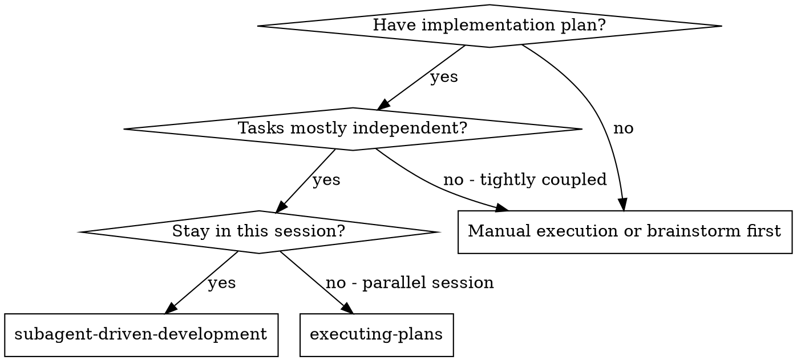
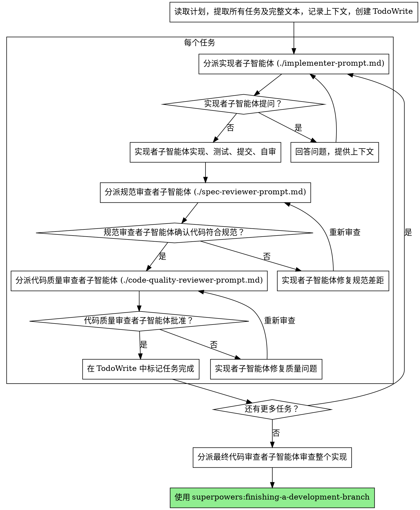

# 子智能体驱动开发

通过为每个任务分派新的子智能体来执行计划，每个任务后进行两阶段审查：首先是规范合规性审查，然后是代码质量审查。

**核心原则：** 每个任务使用新的子智能体 + 两阶段审查（先规范后质量）= 高质量、快速迭代

## 何时使用



**vs. 执行计划（并行会话）：**
- 同一会话（无上下文切换）
- 每个任务使用新的子智能体（无上下文污染）
- 每个任务后进行两阶段审查：先规范合规性，后代码质量
- 更快的迭代（任务之间无需人工介入）

## 流程



## 提示模板

- `./implementer-prompt.md` - 分派实现者子智能体
- `./spec-reviewer-prompt.md` - 分派规范合规性审查者子智能体
- `./code-quality-reviewer-prompt.md` - 分派代码质量审查者子智能体

## 示例工作流

```
你：我正在使用子智能体驱动开发来执行此计划。

[读取计划文件一次：docs/plans/feature-plan.md]
[提取所有 5 个任务及完整文本和上下文]
[创建包含所有任务的 TodoWrite]

任务 1：钩子安装脚本

[获取任务 1 的文本和上下文（已提取）]
[分派实现子智能体，携带完整任务文本 + 上下文]

实现者："在开始之前 - 钩子应该安装在用户级别还是系统级别？"

你："用户级别 (~/.config/superpowers/hooks/)"

实现者："明白了。现在开始实现..."
[稍后] 实现者：
  - 实现了 install-hook 命令
  - 添加了测试，5/5 通过
  - 自审：发现遗漏了 --force 标志，已添加
  - 已提交

[分派规范合规性审查者]
规范审查者：✅ 符合规范 - 满足所有要求，无额外内容

[获取 git SHA，分派代码质量审查者]
代码审查者：优点：测试覆盖良好，代码干净。问题：无。已批准。

[标记任务 1 完成]

任务 2：恢复模式

[获取任务 2 的文本和上下文（已提取）]
[分派实现子智能体，携带完整任务文本 + 上下文]

实现者：[无问题，继续]
实现者：
  - 添加了验证/修复模式
  - 8/8 测试通过
  - 自审：一切良好
  - 已提交

[分派规范合规性审查者]
规范审查者：❌ 问题：
  - 缺失：进度报告（规范要求"每 100 项报告一次"）
  - 多余：添加了 --json 标志（未要求）

[实现者修复问题]
实现者：移除了 --json 标志，添加了进度报告

[规范审查者再次审查]
规范审查者：✅ 现在符合规范

[分派代码质量审查者]
代码审查者：优点：扎实。问题（重要）：魔法数字 (100)

[实现者修复]
实现者：提取了 PROGRESS_INTERVAL 常量

[代码审查者再次审查]
代码审查者：✅ 已批准

[标记任务 2 完成]

...

[所有任务完成后]
[分派最终代码审查者]
最终审查者：满足所有要求，准备合并

完成！
```

## 优势

**vs. 手动执行：**
- 子智能体自然地遵循 TDD
- 每个任务都有新的上下文（无混淆）
- 并行安全（子智能体不会相互干扰）
- 子智能体可以提问（工作前和工作期间）

**vs. 执行计划：**
- 同一会话（无需交接）
- 持续进展（无需等待）
- 审查检查点自动进行

**效率提升：**
- 无文件读取开销（控制器提供完整文本）
- 控制器精心策划所需的确切上下文
- 子智能体预先获得完整信息
- 问题在工作开始前浮出水面（而非之后）

**质量关卡：**
- 自审在交接前发现问题
- 两阶段审查：先规范合规性，后代码质量
- 审查循环确保修复实际有效
- 规范合规性防止过度/不足构建
- 代码质量确保实现构建良好

**成本：**
- 更多的子智能体调用（每个任务需要实现者 + 2 个审查者）
- 控制器需要做更多准备工作（预先提取所有任务）
- 审查循环增加迭代次数
- 但能及早发现问题（比以后调试更便宜）

## 危险信号

**绝不：**
- 跳过审查（规范合规性或代码质量）
- 在问题未修复的情况下继续
- 并行分派多个实现子智能体（冲突）
- 让子智能体读取计划文件（改为提供完整文本）
- 跳过场景设置上下文（子智能体需要理解任务适合的位置）
- 忽视子智能体的问题（在让他们继续之前回答）
- 在规范合规性上接受"差不多就行"（规范审查者发现问题 = 未完成）
- 跳过审查循环（审查者发现问题 = 实现者修复 = 再次审查）
- 让实现者自审取代实际审查（两者都需要）
- **在规范合规性 ✅ 之前开始代码质量审查**（顺序错误）
- 在任一审查有未解决问题时进入下一个任务

**如果子智能体提问：**
- 清晰完整地回答
- 如有需要提供额外上下文
- 不要急于让他们进入实现

**如果审查者发现问题：**
- 实现者（同一子智能体）修复它们
- 审查者再次审查
- 重复直到批准
- 不要跳过重新审查

**如果子智能体任务失败：**
- 分派修复子智能体，携带具体指令
- 不要尝试手动修复（上下文污染）

## 集成

**必需的工作流技能：**
- **superpowers:writing-plans** - 创建此技能执行的计划
- **superpowers:requesting-code-review** - 审查者子智能体的代码审查模板
- **superpowers:finishing-a-development-branch** - 所有任务完成后完成开发

**子智能体应使用：**
- **superpowers:test-driven-development** - 子智能体为每个任务遵循 TDD

**替代工作流：**
- **superpowers:executing-plans** - 用于并行会话而非同一会话执行
