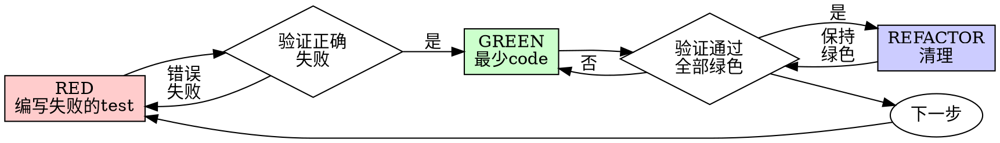

# Test-Driven Development (TDD)

## 概述

先写test。看它失败。编写最少的code使其通过。

**核心原则：** 如果你没有看到test失败，你就不知道它测试的是否正确。

**违反规则的字面意思就是违反规则的精神。**

## 何时使用

**始终使用：**
- 新功能
- Bug修复
- 重构
- 行为变更

**例外情况（询问你的合作伙伴）：**
- 一次性原型
- 生成的code
- 配置文件

想"就这一次跳过TDD"？停下。那是合理化借口。

## 铁律

```
没有失败的test，不得编写生产代码
```

在test之前写了code？删除它。重新开始。

**没有例外：**
- 不要保留它作为"参考"
- 不要在编写tests时"改编"它
- 不要看它
- 删除就是删除

完全从tests开始实现。就这样。

## Red-Green-Refactor（红-绿-重构）



### RED - 编写失败的Test

编写一个最小的test来展示应该发生什么。

<好的示例>
```typescript
test('retries failed operations 3 times', async () => {
  let attempts = 0;
  const operation = () => {
    attempts++;
    if (attempts < 3) throw new Error('fail');
    return 'success';
  };

  const result = await retryOperation(operation);

  expect(result).toBe('success');
  expect(attempts).toBe(3);
});
```
名称清晰，测试真实行为，只做一件事
</好的示例>

<不好的示例>
```typescript
test('retry works', async () => {
  const mock = jest.fn()
    .mockRejectedValueOnce(new Error())
    .mockRejectedValueOnce(new Error())
    .mockResolvedValueOnce('success');
  await retryOperation(mock);
  expect(mock).toHaveBeenCalledTimes(3);
});
```
名称模糊，测试的是mock而不是code
</不好的示例>

**要求：**
- 一个行为
- 清晰的名称
- 真实的code（除非不可避免，否则不使用mocks）

### 验证 RED - 观察它失败

**强制性的。永远不要跳过。**

```bash
npm test path/to/test.test.ts
```

确认：
- Test失败（不是错误）
- 失败消息是预期的
- 失败是因为功能缺失（不是拼写错误）

**Test通过了？** 你在测试现有行为。修复test。

**Test报错？** 修复错误，重新运行直到它正确失败。

### GREEN - 最少Code

编写最简单的code来通过test。

<好的示例>
```typescript
async function retryOperation<T>(fn: () => Promise<T>): Promise<T> {
  for (let i = 0; i < 3; i++) {
    try {
      return await fn();
    } catch (e) {
      if (i === 2) throw e;
    }
  }
  throw new Error('unreachable');
}
```
刚好足够通过
</好的示例>

<不好的示例>
```typescript
async function retryOperation<T>(
  fn: () => Promise<T>,
  options?: {
    maxRetries?: number;
    backoff?: 'linear' | 'exponential';
    onRetry?: (attempt: number) => void;
  }
): Promise<T> {
  // YAGNI
}
```
过度设计
</不好的示例>

不要添加功能，不要重构其他code，不要超出test范围进行"改进"。

### 验证 GREEN - 观察它通过

**强制性的。**

```bash
npm test path/to/test.test.ts
```

确认：
- Test通过
- 其他tests仍然通过
- 输出纯净（没有错误、警告）

**Test失败？** 修复code，不是test。

**其他tests失败？** 立即修复。

### REFACTOR - 清理

仅在green之后：
- 移除重复
- 改进名称
- 提取辅助函数

保持tests绿色。不要添加行为。

### 重复

为下一个功能编写下一个失败的test。

## 好的Tests

| 质量 | 好的 | 不好的 |
|---------|------|-----|
| **最小化** | 一件事。名称中有"and"？拆分它。 | `test('validates email and domain and whitespace')` |
| **清晰** | 名称描述行为 | `test('test1')` |
| **展示意图** | 展示期望的API | 模糊code应该做什么 |

## 为什么顺序很重要

**"我会在之后写tests来验证它是否工作"**

在code之后编写的tests会立即通过。立即通过证明不了什么：
- 可能测试了错误的东西
- 可能测试了实现，而不是行为
- 可能遗漏了你忘记的边界情况
- 你从未看到它捕获bug

Test-first迫使你看到test失败，证明它确实在测试某些东西。

**"我已经手动测试了所有边界情况"**

手动测试是临时性的。你以为你测试了所有内容，但是：
- 没有测试记录
- code变更时无法重新运行
- 压力下容易忘记情况
- "我试的时候它工作了" ≠ 全面的

自动化测试是系统性的。它们每次都以相同的方式运行。

**"删除X小时的工作是浪费"**

沉没成本谬误。时间已经过去了。你现在面临的选择：
- 删除并用TDD重写（再花X小时，高信心）
- 保留它并在之后添加tests（30分钟，低信心，可能有bug）

"浪费"是保留你无法信任的code。没有真实tests的可用code是技术债务。

**"TDD是教条主义的，务实意味着灵活变通"**

TDD就是务实的：
- 在提交前发现bug（比事后debug更快）
- 防止回归（tests立即捕获破坏）
- 记录行为（tests展示如何使用code）
- 启用重构（自由变更，tests捕获破坏）

"务实的"捷径 = 在生产环境中debug = 更慢。

**"Tests after能达到同样的目标 - 重要的是精神而不是仪式"**

不。Tests-after回答"这做了什么？"Tests-first回答"这应该做什么？"

Tests-after受你的实现偏见影响。你测试的是你构建的，而不是所需的。你验证的是你记住的边界情况，而不是发现的。

Tests-first强制在实施前发现边界情况。Tests-after验证你是否记住了所有内容（你没有）。

30分钟的tests after ≠ TDD。你得到了覆盖率，但失去了tests有效的证明。

## 常见的合理化借口

| 借口 | 现实 |
|--------|---------|
| "太简单了，不需要test" | 简单的code也会出问题。Test只需要30秒。 |
| "我之后会test" | Tests立即通过证明不了什么。 |
| "Tests after能达到同样的目标" | Tests-after = "这做了什么？" Tests-first = "这应该做什么？" |
| "已经手动测试过了" | 临时性的 ≠ 系统性的。没有记录，无法重新运行。 |
| "删除X小时是浪费" | 沉没成本谬误。保留未验证的code是技术债务。 |
| "保留作为参考，先写tests" | 你会改编它。那就是testing after。删除就是删除。 |
| "需要先探索一下" | 可以。扔掉探索，从TDD开始。 |
| "Test难写 = 设计不清晰" | 倾听test的声音。难以test = 难以使用。 |
| "TDD会拖慢我" | TDD比debug更快。务实 = test-first。 |
| "手动测试更快" | 手动测试无法证明边界情况。你会在每次变更时重新测试。 |
| "现有code没有tests" | 你正在改进它。为现有code添加tests。 |

## 危险信号 - 停止并重新开始

- Test之前写code
- 实现之后写test
- Test立即通过
- 无法解释test为什么失败
- "稍后"添加tests
- 合理化"就这一次"
- "我已经手动测试过了"
- "Tests after能达到同样的目的"
- "重要的是精神而不是仪式"
- "保留作为参考"或"改编现有code"
- "已经花了X小时，删除是浪费"
- "TDD是教条主义的，我在务实"
- "这次不同，因为..."

**所有这些都意味着：删除code。用TDD重新开始。**

## 示例：Bug修复

**Bug：** 接受了空email

**RED**
```typescript
test('rejects empty email', async () => {
  const result = await submitForm({ email: '' });
  expect(result.error).toBe('Email required');
});
```

**验证 RED**
```bash
$ npm test
FAIL: expected 'Email required', got undefined
```

**GREEN**
```typescript
function submitForm(data: FormData) {
  if (!data.email?.trim()) {
    return { error: 'Email required' };
  }
  // ...
}
```

**验证 GREEN**
```bash
$ npm test
PASS
```

**REFACTOR**
如果需要，为多字段提取验证。

## 验证清单

在标记工作完成之前：

- [ ] 每个新函数/方法都有一个test
- [ ] 在实施前观察每个test失败
- [ ] 每个test因预期原因失败（功能缺失，不是拼写错误）
- [ ] 编写了最少的code来通过每个test
- [ ] 所有tests通过
- [ ] 输出纯净（没有错误、警告）
- [ ] Tests使用真实的code（除非不可避免，否则不使用mocks）
- [ ] 边界情况和错误已覆盖

无法勾选所有框？你跳过了TDD。重新开始。

## 卡住时

| 问题 | 解决方案 |
|---------|----------|
| 不知道如何test | 编写期望的API。先写assertion。询问你的合作伙伴。 |
| Test太复杂 | 设计太复杂。简化接口。 |
| 必须mock所有东西 | Code耦合度太高。使用依赖注入。 |
| Test设置庞大 | 提取辅助函数。仍然复杂？简化设计。 |

## Debug集成

发现Bug？编写重现它的失败test。遵循TDD循环。Test证明修复并防止回归。

永远不要在没有test的情况下修复bug。

## Testing反模式

添加mocks或test工具时，阅读 @testing-anti-patterns.md 以避免常见陷阱：
- 测试mock行为而不是真实行为
- 向生产类添加仅用于test的方法
- 在不理解依赖的情况下进行mocking

## 最终规则

```
Production code → test存在且先失败
否则 → 不是TDD
```

未经合作伙伴许可，没有例外。
