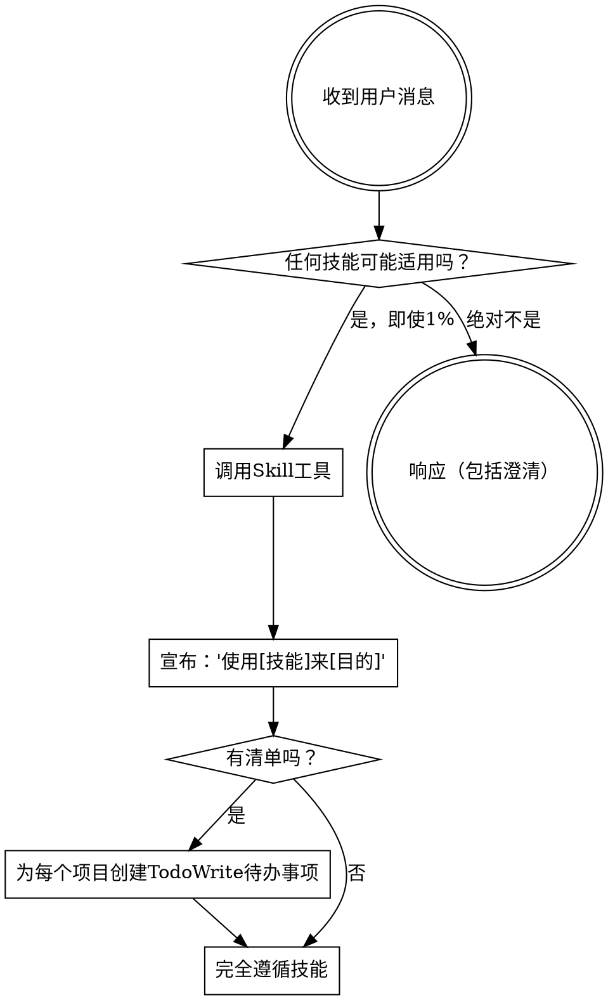

<极其重要>
如果你认为有哪怕1%的机会某个技能可能适用于你正在做的事情，你绝对必须调用该技能。

如果某个技能适用于你的任务，你别无选择。你必须使用它。

这是不可协商的。这不是可选的。你不能为此找理由。
</极其重要>

## 如何访问技能

**在Claude Code中：** 使用`Skill`工具。当你调用技能时，其内容会被加载并呈现给你——直接遵循它。永远不要使用Read工具读取技能文件。

**在其他环境中：** 查看你的平台文档了解如何加载技能。

# 使用技能

## 规则

**在做出任何响应或行动之前调用相关或请求的技能。** 即使1%的机会某个技能可能适用也意味着你应该调用该技能来检查。如果被调用的技能最终不适合该情况，你不需要使用它。

## 红旗

这些想法意味着停止——你在合理化：

| 想法 | 现实 |
|------|------|
| "这只是个简单问题" | 问题是任务。检查技能。 |
| "我需要先获取更多上下文" | 技能检查在澄清问题之前。 |
| "让我先快速查看代码库" | 技能告诉你如何探索。先检查。 |
| "我可以快速检查git/文件" | 文件缺乏对话上下文。检查技能。 |
| "让我先收集信息" | 技能告诉你如何收集信息。 |
| "这不需要正式技能" | 如果技能存在，使用它。 |
| "我记得这个技能" | 技能会演进。阅读当前版本。 |
| "这不算任务" | 行动 = 任务。检查技能。 |
| "这个技能大材小用" | 简单的事情会变得复杂。使用它。 |
| "我先做这一件事" | 在做任何事之前先检查。 |
| "这感觉很有成效" | 无纪律的行动浪费时间。技能防止这一点。 |
| "我知道那是什么意思" | 知道概念 ≠ 使用技能。调用它。 |

## 技能优先级

当多个技能可能适用时，使用此顺序：

1. **流程技能优先**（头脑风暴、调试）- 这些决定如何接近任务
2. **实施技能其次**（前端设计、mcp构建器）- 这些指导执行

"让我们构建X" → 先头脑风暴，然后实施技能。
"修复这个错误" → 先调试，然后领域特定技能。

## 技能类型

**严格**（TDD、调试）：完全遵循。不要偏离纪律。

**灵活**（模式）：根据上下文调整原则。

技能本身会告诉你属于哪种。

## 用户指令

指令说明WHAT，而非HOW。"添加X"或"修复Y"不意味着跳过工作流。
