# AI 智能体配置模板 - AI 上下文文档

> **最后更新**: 2025-12-25 22:33:04  
> **项目摘要**: 一站式AI开发环境配置解决方案，提供从框架搭建到生产部署的全套配置模板和专家级提示词库

---

## 📋 目录

- [项目愿景](#项目愿景)
- [架构总览](#架构总览)
- [模块索引](#模块索引)
- [全局规范](#全局规范)
- [快速导航](#快速导航)

---

## 🎯 项目愿景

### 核心定位

**AI 智能体配置模板**是一个标准化、模块化的AI开发环境配置库，旨在帮助开发者和企业用户**30分钟快速搭建**高质量的AI助手开发环境。

### 核心价值

- ⚡ **快速启动**: 开箱即用，大幅缩短开发周期
- 🌐 **多平台支持**: 兼容Claude、ModelScope、Trae CN等主流AI平台
- 🧠 **专家级提示词**: 经过实战验证的专家配置库
- 🧩 **模块化设计**: 灵活组合，按需配置
- 🏢 **企业级规范**: 遵循6A原则和行业最佳实践

### 目标用户

1. **个人开发者**: 快速搭建个人项目开发环境
2. **企业团队**: 标准化团队AI开发流程
3. **业务分析师**: 使用专业提示词专家完成业务设计任务
4. **零基础用户**: 通过完整指南快速上手

---

## 🏗️ 架构总览

### 三层架构设计

```
┌─────────────────────────────────────────┐
│           应用层 (Application)           │
├─────────────────────────────────────────┤
│  专家提示词库  │  框架配置库  │  文档模板库  │
├─────────────────────────────────────────┤
│            服务层 (Service)             │
├─────────────────────────────────────────┤
│   MCP服务配置  │  API集成  │  安全认证    │
├─────────────────────────────────────────┤
│         基础层 (Infrastructure)         │
├─────────────────────────────────────────┤
│  操作系统兼容  │  平台适配  │  部署环境   │
└─────────────────────────────────────────┘
```

### 项目结构图

```mermaid
graph TB
    Root[AI 智能体配置模板] --> Guide[AI赋能业务设计-智能体搭建指南及配套知识库套件]
    Root --> Image[image/]
    Root --> README[README.md]
    
    Guide --> Install[00-工具安装包]
    Guide --> FullGuide[01-完整指南]
    Guide --> QuickConfig[02-快速配置]
    Guide --> Framework[03-框架搭建]
    Guide --> Rules[04-规则配置]
    Guide --> Services[05-服务配置]
    Guide --> Templates[06-提示词模板库]
    Guide --> Cases[07-实战案例]
    Guide --> GuideReadme[README.md]
    
    Framework --> V1[v1-system-prompt.md]
    Framework --> V2[v2-system-prompt.md]
    Framework --> V3[v3-system-prompt.md]
    
    Rules --> PersonalRules[通用配置/个人规则.md]
    Rules --> ProjectRules[项目规则/6A执行规则.md]
    
    Services --> MCPConfig[MCP服务/通用mcp配置.json]
    
    Templates --> ReqAnalysis[01-需求分析]
    Templates --> Prototype[02-原型设计]
    Templates --> Testing[03-测试验证]
    Templates --> General[04-通用专家]
    Templates --> TemplatesReadme[README.md]
    
    ReqAnalysis --> ReqGen[需求生成专家.md]
    ReqAnalysis --> Feasibility[可研生成专家.md]
    ReqAnalysis --> PRD[PRD生成专家.md]
    
    Prototype --> PC[PC端]
    Prototype --> APP[APP端]
    Prototype --> UI[UI规范专家.md]
    
    PC --> Dashboard[看板风格专家.md]
    PC --> System[系统风格专家.md]
    PC --> Simple[简约风格专家.md]
    
    APP --> StateGrid[国网风专家.md]
    APP --> Diffuse[弥散风专家.md]
    APP --> Apple[苹果风专家.md]
    
    Testing --> FuncTest[功能测试专家.md]
    Testing --> AutoTest[自动化测试专家.md]
    Testing --> DocCheck[文档质量校验专家.md]
    
    General --> PPT[PPT生成专家.md]
    General --> Weekly[周报生成专家.md]
    General --> Prompt[提示词生成专家.md]
    General --> Web[网页生成专家.md]
    
    FullGuide --> BasicGuide[00-Trae IDE 零基础小白操作指南.md]
    FullGuide --> ExecScript[01-Trae IDE 辅助业务设计具体执行脚本.md]
    
    Install --> InstallUrl[安装网址.md]
    QuickConfig --> QuickList[快速配置清单.md]
    Cases --> CaseLib[实战案例库.md]
    
    style Root fill:#009D85,stroke:#006B5C,stroke-width:3px,color:#fff
    style Guide fill:#4ECDC4,stroke:#009D85,stroke-width:2px
    style Templates fill:#A5D8FF,stroke:#4ECDC4,stroke-width:2px
    style ReqAnalysis fill:#FFE5B4,stroke:#FFB84D,stroke-width:2px
    style Prototype fill:#E8F5E9,stroke:#66BB6A,stroke-width:2px
    style Testing fill:#FFF3E0,stroke:#FFA726,stroke-width:2px
    style General fill:#F3E5F5,stroke:#BA68C8,stroke-width:2px
```



### 核心模块说明

#### 1. 指南套件模块 (`AI赋能业务设计-智能体搭建指南及配套知识库套件/`)
- **定位**: 完整的操作指南和知识库
- **包含**: 工具安装包、完整指南、快速配置、提示词模板库、实战案例
- **目标用户**: 从零基础到资深开发者的完整学习路径

#### 2. 框架搭建模块 (`03-框架搭建/`)
- **定位**: React B端管理系统标准化提示词配置
- **包含**: v1基础版、v2增强版、v3专业版三个版本
- **目标用户**: 需要快速搭建React管理系统的开发者

#### 3. 规则配置模块 (`04-规则配置/`)
- **定位**: AI执行规则和约束配置
- **包含**: 个人规则、项目规则（6A执行规则）
- **目标用户**: 需要规范AI行为的开发者和团队

#### 4. 服务配置模块 (`05-服务配置/`)
- **定位**: MCP服务配置文件
- **包含**: 通用MCP服务配置（Sequential Thinking、context7、Chrome DevTools等）
- **目标用户**: 需要配置MCP服务的用户

#### 5. 提示词模板库模块 (`06-提示词模板库/`)
- **定位**: 专业提示词专家配置库
- **包含**: 需求分析、原型设计、测试验证、通用专家四大类16个专家
- **目标用户**: 需要专业AI助手的业务人员

#### 5. 文档资源模块
- **定位**: 项目说明和资源文件
- **包含**: README.md、图片资源等

---

## 📦 模块索引

### 主要模块列表

| 模块路径 | 模块名称 | 类型 | 说明 |
|---------|---------|------|------|
| `AI赋能业务设计-智能体搭建指南及配套知识库套件/` | 指南套件 | 文档库 | 完整的操作指南和知识库套件 |
| `AI赋能业务设计-智能体搭建指南及配套知识库套件/00-工具安装包/` | 工具安装包 | 资源 | Trae CN、Node.js、Python安装包和安装指南 |
| `AI赋能业务设计-智能体搭建指南及配套知识库套件/01-完整指南/` | 完整指南 | 文档 | Trae IDE零基础操作指南和执行脚本 |
| `AI赋能业务设计-智能体搭建指南及配套知识库套件/02-快速配置/` | 快速配置 | 文档 | 5分钟快速上手指南 |
| `AI赋能业务设计-智能体搭建指南及配套知识库套件/03-框架搭建/` | 框架搭建 | 配置库 | React管理系统标准化提示词（v1/v2/v3） |
| `AI赋能业务设计-智能体搭建指南及配套知识库套件/04-规则配置/` | 规则配置 | 配置库 | 个人规则、项目规则（6A执行规则） |
| `AI赋能业务设计-智能体搭建指南及配套知识库套件/05-服务配置/` | 服务配置 | 配置库 | MCP服务配置文件 |
| `AI赋能业务设计-智能体搭建指南及配套知识库套件/06-提示词模板库/` | 提示词模板库 | 配置库 | 16个专业提示词专家配置 |
| `AI赋能业务设计-智能体搭建指南及配套知识库套件/06-提示词模板库/01-需求分析/` | 需求分析专家 | 配置 | 需求生成、可研生成、PRD生成专家 |
| `AI赋能业务设计-智能体搭建指南及配套知识库套件/06-提示词模板库/02-原型设计/` | 原型设计专家 | 配置 | PC端、APP端、UI规范专家 |
| `AI赋能业务设计-智能体搭建指南及配套知识库套件/06-提示词模板库/03-测试验证/` | 测试验证专家 | 配置 | 功能测试、自动化测试、文档校验专家 |
| `AI赋能业务设计-智能体搭建指南及配套知识库套件/06-提示词模板库/04-通用专家/` | 通用专家 | 配置 | PPT、周报、提示词、网页生成专家 |
| `AI赋能业务设计-智能体搭建指南及配套知识库套件/07-实战案例/` | 实战案例 | 文档 | 3个完整项目实战案例 |

### 模块依赖关系

```
指南套件
├── 工具安装包 (独立)
├── 完整指南 (依赖: 工具安装包)
├── 快速配置 (独立)
├── 框架搭建 (独立)
│   ├── v1基础版 (独立)
│   ├── v2增强版 (独立)
│   └── v3专业版 (独立)
├── 规则配置 (独立)
│   ├── 个人规则 (独立)
│   └── 项目规则 (独立)
├── 服务配置 (独立)
│   └── MCP服务 (独立)
├── 提示词模板库 (独立)
│   ├── 需求分析 (独立)
│   ├── 原型设计 (独立)
│   ├── 测试验证 (独立)
│   └── 通用专家 (独立)
└── 实战案例 (依赖: 完整指南 + 提示词模板库)
```

---

## 📏 全局规范

### 文档规范

#### 文件命名规范
- **Markdown文件**: 使用中文名称，描述清晰
- **目录命名**: 使用数字前缀（00-、01-）表示顺序
- **专家文件**: 统一后缀为"专家.md"

#### 文档结构规范
- **必须包含**: 标题、角色定位、任务目标、核心要求、快速开始
- **可选包含**: 使用技巧、注意事项、技术支持
- **格式要求**: Markdown格式，使用标准标题层级

### 代码规范

#### 提示词编写规范
- **清晰明确**: 使用简洁的中文表达
- **结构化**: 使用标题、列表、表格等结构化元素
- **可执行**: 提供具体的操作步骤和示例
- **可测试**: 包含明确的验收标准

#### 配置规范
- **JSON配置**: 使用标准JSON格式，包含注释说明
- **环境变量**: 敏感信息使用环境变量
- **版本管理**: 使用语义化版本号

### 工作流程规范

#### 6A执行原则
1. **Accurate** (准确) - 确保信息准确性
2. **Analytical** (分析) - 深度分析问题
3. **Actionable** (可执行) - 提供可执行的解决方案
4. **Adaptable** (适应) - 适应不同场景需求
5. **Accountable** (负责) - 对结果负责
6. **Agile** (敏捷) - 快速响应变化

#### 开发流程
```
需求分析 → 原型设计 → 开发实现 → 测试验证 → 文档输出
```

### 安全规范

- ❌ **禁止**: 在配置文件中硬编码API密钥
- ✅ **推荐**: 使用环境变量管理敏感信息
- ✅ **推荐**: 限制MCP服务的文件访问权限
- ✅ **推荐**: 定期更新API密钥和服务

---

## 🗺️ 快速导航

### 按使用场景导航

#### 🚀 快速开始（5分钟）
1. [快速配置清单](./AI赋能业务设计-智能体搭建指南及配套知识库套件/02-快速配置/快速配置清单.md)
2. [工具安装包](./AI赋能业务设计-智能体搭建指南及配套知识库套件/00-工具安装包/)

#### 📚 系统学习（完整路径）
1. [零基础操作指南](./AI赋能业务设计-智能体搭建指南及配套知识库套件/01-完整指南/00-Trae%20IDE%20零基础小白操作指南.md)
2. [执行脚本](./AI赋能业务设计-智能体搭建指南及配套知识库套件/01-完整指南/01-Trae%20IDE%20%20辅助业务设计具体执行脚本.md)
3. [实战案例](./AI赋能业务设计-智能体搭建指南及配套知识库套件/06-实战案例/实战案例库.md)

#### ⚙️ 框架、规则与服务配置
- [框架搭建](./AI赋能业务设计-智能体搭建指南及配套知识库套件/03-框架搭建/)
- [规则配置](./AI赋能业务设计-智能体搭建指南及配套知识库套件/04-规则配置/)
- [服务配置](./AI赋能业务设计-智能体搭建指南及配套知识库套件/05-服务配置/)

#### 🧠 专家配置（按需选择）
- [需求分析专家](./AI赋能业务设计-智能体搭建指南及配套知识库套件/06-提示词模板库/01-需求分析/)
- [原型设计专家](./AI赋能业务设计-智能体搭建指南及配套知识库套件/06-提示词模板库/02-原型设计/)
- [测试验证专家](./AI赋能业务设计-智能体搭建指南及配套知识库套件/06-提示词模板库/03-测试验证/)
- [通用专家](./AI赋能业务设计-智能体搭建指南及配套知识库套件/06-提示词模板库/04-通用专家/)

### 按角色导航

#### 👨‍💻 个人开发者
- 快速配置 → 选择专家 → 开始项目

#### 🏢 企业团队
- 环境标准化 → 智能体库建设 → 培训交付

#### 📊 业务分析师
- 需求分析专家 → 原型设计专家 → 文档输出

---

## 📊 项目统计

### 文件统计
- **总文件数**: ~30+ 个Markdown文档
- **主要模块**: 5个核心模块
- **专家配置**: 16个专业提示词专家
- **实战案例**: 3个完整项目案例

### 覆盖范围
- ✅ **指南文档**: 完整覆盖从安装到精通的全部流程
- ✅ **专家配置**: 覆盖需求分析、设计、测试、通用四大领域
- ✅ **实战案例**: 提供APP、管理系统、数据看板三类案例
- ✅ **配置模板**: 提供MCP服务配置、框架配置、执行规则

---

## 🔄 更新记录

### 2025-12-25 22:33:04
- ✨ 更新项目结构（新增03-框架搭建模块）
- ✨ 修正Mermaid结构图，添加框架搭建模块
- ✨ 更新模块索引和导航体系
- ✨ 为缺失模块生成CLAUDE.md文档（03-框架搭建、03-测试验证、04-通用专家）
- ✨ 修正模块路径编号（04-规则配置、05-服务配置、06-提示词模板库、07-实战案例）

### 2025-12-25 22:22:38
- ✨ 更新项目结构（新增04-规则配置、05-服务配置模块）
- ✨ 更新Mermaid结构图以反映新结构
- ✨ 更新模块索引和导航体系
- ✨ 为新增模块生成CLAUDE.md文档

### 2025-12-25 21:34:24
- ✨ 初始化项目AI上下文文档
- ✨ 生成Mermaid结构图
- ✨ 建立模块索引和导航体系
- ✨ 为各模块添加导航面包屑

---

## 📝 下一步建议

### 推荐优先补扫的路径
1. **提示词专家详细内容**: 深入阅读各专家配置的完整内容
2. **实战案例详细流程**: 了解完整项目开发流程
3. **执行脚本细节**: 理解6A工作流程的具体执行方式

### 待完善内容
- [ ] 添加更多实战案例
- [ ] 扩展专家配置库
- [ ] 完善MCP服务配置说明
- [ ] 添加视频教程链接

---

**文档维护**: 本文档由 `/init-project` 命令自动生成和维护  
**最后扫描**: 2025-12-25 22:33:04  
**扫描覆盖率**: 核心模块 100%，所有模块已生成CLAUDE.md文档

