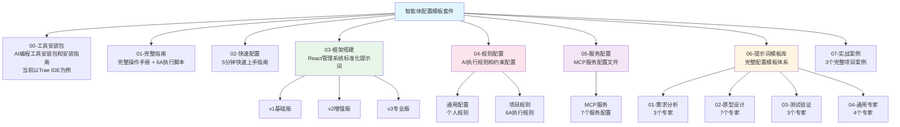

# 智能体配置模板套件 - AI 上下文文档

> **导航**: [根目录](./CLAUDE.md) > **智能体配置模板套件**

---

## 📋 模块概述

**模块名称**: 智能体配置模板套件  
**模块类型**: 配置模板库/知识库  
**模块定位**: 通用的AI编程工具智能体配置模板套件，提供从环境搭建到生产交付的全套解决方案。当前以Trae IDE为例，后续将扩展支持更多AI编程工具

### 核心功能
- 📚 提供从环境搭建到生产交付的全套解决方案
- 🎯 支持从零基础小白到资深开发者的完整学习路径
- 🛠️ 包含安装包、配置模板、专家提示词，开箱即用
- 💼 基于真实业务场景，提供完整执行脚本

---

## 📁 模块结构

### 目录树
```
智能体配置模板套件/
├── 00-工具安装包/          # AI编程工具安装包和安装指南（当前以Trae IDE为例）
├── 01-完整指南/            # 完整操作手册 + 6A执行脚本
├── 02-快速配置/            # 5分钟快速上手指南
├── 03-框架搭建/            # React管理系统标准化提示词
├── 04-规则配置/            # AI执行规则和约束配置
├── 05-服务配置/            # MCP服务配置文件
├── 06-提示词模板库/        # 完整配置模板体系
├── 07-实战案例/            # 3个完整项目案例
└── README.md               # 模块说明文档
```

### 项目结构图（Mermaid）



### 子模块说明

| 子模块 | 路径 | 说明 | 关键文件 |
|--------|------|------|----------|
| 工具安装包 | `00-工具安装包/` | AI编程工具安装包和安装指南（当前以Trae IDE为例，后续将扩展） | `安装网址.md` |
| 完整指南 | `01-完整指南/` | 零基础操作指南和执行脚本（当前以Trae IDE为例） | `00-Trae IDE 零基础小白操作指南.md`<br>`01-Trae IDE 辅助业务设计具体执行脚本.md` |
| 快速配置 | `02-快速配置/` | 5分钟快速上手指南 | `快速配置清单.md` |
| 框架搭建 | `03-框架搭建/` | React管理系统标准化提示词（v1/v2/v3） | 详见 [框架搭建模块文档](./03-框架搭建/CLAUDE.md) |
| 规则配置 | `04-规则配置/` | AI执行规则和约束配置 | 详见 [规则配置模块文档](./04-规则配置/CLAUDE.md) |
| 服务配置 | `05-服务配置/` | MCP服务配置文件 | 详见 [服务配置模块文档](./05-服务配置/CLAUDE.md) |
| 提示词模板库 | `06-提示词模板库/` | 16个专业提示词专家配置 | 详见 [提示词模板库模块文档](./06-提示词模板库/CLAUDE.md) |
| 实战案例 | `07-实战案例/` | 3个完整项目实战案例 | `实战案例库.md` |

---

## 🔗 模块依赖

### 内部依赖
- **完整指南** 依赖 **工具安装包**（需要先安装工具）
- **框架搭建** 依赖 **工具安装包**（需要Node.js环境）
- **服务配置** 依赖 **工具安装包**（需要Node.js环境）
- **实战案例** 依赖 **完整指南** + **提示词模板库**（需要理解操作流程和专家配置）

### 外部依赖
- **Node.js** (版本 >= 14)
- **AI编程工具**（当前以Trae IDE为例，后续将支持更多工具）
- **基础开发环境**（可选，用于运行生成的代码）

### 工具扩展说明
- **当前支持**: Trae IDE（作为示例和起点）
- **扩展计划**: 后续将逐步纳入更多AI编程工具（如Cursor、GitHub Copilot、Codeium等）
- **通用性**: 配置模板和提示词库设计为通用格式，可适配不同AI编程工具

---

## 📖 关键文件说明

### 入口文件

#### 1. README.md
- **位置**: `智能体配置模板套件/README.md`
- **作用**: 模块总导航，介绍整体框架和学习路径
- **关键内容**: 
  - 项目概述和核心特色
  - 快速开始指南（新手/系统学习/企业级）
  - 各文件夹详细说明
  - 推荐使用流程

#### 2. 快速配置清单.md
- **位置**: `02-快速配置/快速配置清单.md`
- **作用**: 5分钟快速上手指南
- **关键内容**:
  - 安装验证步骤
  - 个人规则配置
  - 项目规则配置
  - MCP配置
  - 智能体创建
  - 验证配置

#### 3. Trae IDE 零基础小白操作指南.md
- **位置**: `01-完整指南/00-Trae IDE 零基础小白操作指南.md`
- **作用**: 完整的操作手册，约15000字
- **关键内容**:
  - 8个章节 + 附录
  - 从安装到精通的完整流程
  - 详细步骤 + 截图位置说明
  - 常见问题 + 效率技巧

#### 4. AI辅助业务设计具体执行脚本.md
- **位置**: `01-完整指南/01-Trae IDE 辅助业务设计具体执行脚本.md`
- **作用**: 6A工作流程的具体执行脚本
- **关键内容**:
  - 6A原则详解（对齐→架构→原子化→审批→自动化→评估）
  - 具体执行步骤
  - 业务设计全流程

#### 5. 框架搭建配置
- **位置**: `03-框架搭建/`
- **作用**: React管理系统标准化提示词配置
- **关键内容**:
  - v1基础版：简单管理系统开发
  - v2增强版：中等复杂度系统开发
  - v3专业版：企业级系统开发

#### 6. 实战案例库.md
- **位置**: `07-实战案例/实战案例库.md`
- **作用**: 3个完整项目从需求到成品的详细教程
- **关键内容**:
  - 案例1: 电费缴纳APP界面设计（15分钟）
  - 案例2: 电力巡检管理系统需求文档（10分钟）
  - 案例3: 销售数据可视化看板（15分钟）

---

## 🎯 使用场景

### 场景1: 零基础用户（30分钟上手）
```
第1步：安装工具
→ 进入 00-工具安装包/ 安装 Trae CN

第2步：基础配置  
→ 使用 02-快速配置/ 快速配置清单.md（5分钟）

第3步：实战演练
→ 跟随 01-完整指南/ AI辅助业务设计具体执行脚本.md（25分钟）
```

### 场景2: 有基础用户（10分钟快速配置）
```
第1步：快速配置
→ 使用 02-快速配置/ 快速配置清单.md

第2步：创建智能体
→ 从 06-提示词模板库/ 选择模板
→ 或使用 03-框架搭建/ 配置框架

第3步：项目开发
→ 参考 07-实战案例/ 实战案例库.md
```

### 场景3: 团队负责人（标准化部署）
```
第1步：环境标准化
→ 00-工具安装包/ 统一分发安装包
→ 02-快速配置/ 制定团队配置标准

第2步：智能体库建设  
→ 06-提示词模板库/ 部署团队标准智能体
→ 03-框架搭建/ 配置团队标准框架
→ 04-规则配置/ 统一6A工作流程

第3步：培训与交付
→ 01-完整指南/ 作为培训教材
→ 07-实战案例/ 作为实战演练
```

---

## 🔧 接口与依赖

### 输入接口
- **用户需求**: 通过AI编程工具对话框输入（当前以Trae IDE为例）
- **配置文件**: MCP服务配置文件
- **规则文件**: 个人规则、项目规则

### 输出接口
- **HTML代码**: 可直接在浏览器运行的页面代码
- **文档输出**: 需求文档、PRD、测试报告等
- **配置模板**: 可直接复制的配置代码

### 依赖关系
```
工具安装包 (独立)
    ↓
完整指南 (依赖工具安装包)
    ↓
快速配置 (独立，可并行)
    ↓
框架搭建 (独立，可并行)
    ↓
提示词模板库 (独立，可并行)
    ↓
实战案例 (依赖完整指南 + 提示词模板库)
```

---

## 📊 模块统计

### 文件统计
- **总文件数**: ~10个核心文档
- **子模块数**: 5个
- **专家配置数**: 16个（在提示词模板库中）
- **实战案例数**: 3个

### 内容覆盖
- ✅ **安装指南**: 完整的工具安装说明
- ✅ **操作指南**: 从零基础到精通的完整流程
- ✅ **快速配置**: 5分钟快速上手指南
- ✅ **实战案例**: 3个完整项目案例
- ✅ **专家配置**: 16个专业提示词专家（详见提示词模板库模块）

---

## 🚀 快速开始

### 推荐学习路径

#### 第1天：环境配置
1. 阅读 `README.md` (5分钟)
2. 按 `02-快速配置/快速配置清单.md` 完成基础配置 (5分钟)
3. 从 `06-提示词模板库/` 选择2-3个智能体创建 (5分钟)

#### 第1周：技能掌握
1. 精读 `01-完整指南/00-Trae IDE 零基础小白操作指南.md`（当前以Trae IDE为例）
2. 完成 `07-实战案例/` 中的1-2个案例
3. 根据需要查阅 `06-提示词模板库/` 创建更多智能体

#### 第1月：精通应用
1. 熟练使用所有核心功能
2. 能独立创建专业智能体
3. 完成复杂业务项目
4. 成为团队AI编程工具配置专家

---

## 📝 注意事项

### 使用限制
- **平台要求**: 需要AI编程工具（当前以Trae IDE为例，后续将支持更多工具）
- **环境要求**: Node.js >= 14
- **学习曲线**: 零基础用户建议按完整指南学习
- **工具扩展**: 当前文档以Trae IDE为例，其他工具的使用方式可能略有差异

### 最佳实践
- **先易后难**: 从快速配置开始，再学习完整指南
- **边学边练**: 阅读指南的同时完成实战案例
- **持续优化**: 根据使用反馈调整个人配置
- **团队共享**: 将优质配置分享给团队成员

---

## 🔗 相关链接

- [项目主README](./README.md)
- [框架搭建模块文档](./03-框架搭建/CLAUDE.md)
- [规则配置模块文档](./04-规则配置/CLAUDE.md)
- [服务配置模块文档](./05-服务配置/CLAUDE.md)
- [提示词模板库模块文档](./06-提示词模板库/CLAUDE.md)

---

**文档版本**: v1.0.1  
**最后更新**: 2025-12-26  
**维护人**: yuhang

